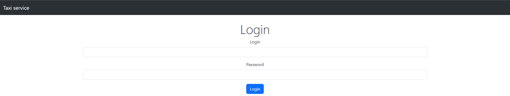
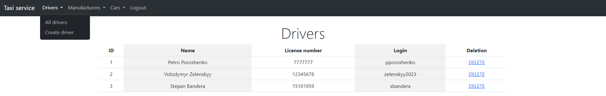
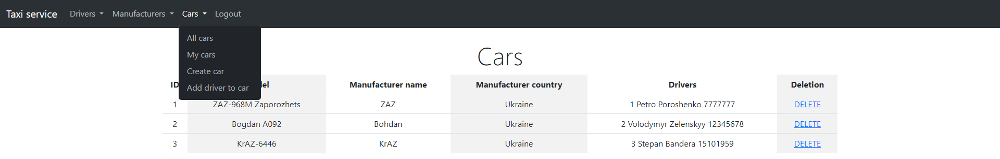
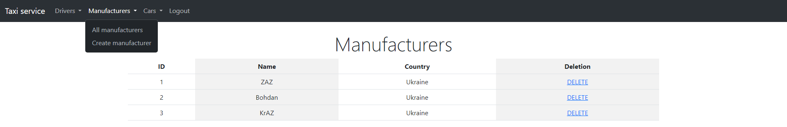

# 🚕Taxi Service🚕

This is a simple project to show my Java, JDBC, WEB, OOP, and SOLID skills. In this project, I used basic CRUD operations. One-to-one, one-to-many, and many-to-many relationships are used in databases.

## 🧑‍💻 Technologies
| Technology | Version |
|:-----------|:--------|
| JDK        | 11      |
| Maven      | 4.0.0   |
| Tomcat     | 9.0.76  |
| MySQL      | 8.0.22  |
| JDBC       | -       |
| Servlet    | 4.0.1   |
| JSTL       | 1.2     |
| JSP        | -       |
| HTML, CSS  | -       |
| Bootstrap  | 5       |

## 🔧Structure
#### Project has N-Tier architecture:
| Layer                            | Assignment                                                                                                                                 |
|----------------------------------|--------------------------------------------------------------------------------------------------------------------------------------------|
| Controllers (Presentation layer) | Receives requests from the client, transmits them to the service layer, and returns JSP pages in response.                                 |
| Services (Application layer)     | Receives requests from the controller layer, transmits them to the DAO layer, <br/>receives a response from the DAO, and executes business |
| DAO (Data access layer)          | Receives requests from the service layer, transfers them to the database, and executes SQL queries                                         |


| Controller                    | Path                  | Action                                |
|-------------------------------|-----------------------|---------------------------------------|
| LoginController               | /login                | authentication                        |
| LogoutController              | /logout               | invalidate current session            |
|                               |                       |                                       |
| AddCarController              | /cars/add             | adds a new car                        |
| AddDriverToCarController      | /cars/drivers/add     | adds a driver to a certain car        |
| DeleteCarController           | /cars/delete          | deletes car                           |
| GetAllCarsController          | /cars                 | views all cars                        |
|                               |                       |                                       |
| AddDriverController           | /drivers/add          | adds a driver                         |
| DeleteDriverController        | /drivers/delete       | deletes driver                        |
| GetAllDriversController       | /drivers              | views all drivers                     |
| GetMyCurrentCarsController    | /drivers/cars         | views all cars for the current driver |
|                               |                       |                                       |
| AddManufacturersController    | /manufacturers/add    | adds new manufacturer                 |
| DeleteManufacturerController  | /manufacturers/delete | deletes manufacturer                  |
| GetAllManufacturersController | /manufacturers        | views all manufacturers               |
|                               |                       |                                       |
| IndexController               | / & /index            | show all corresponding pages          |

## 🔨How To Run And Test This Web Application?
1. Install the necessary software: JDK, Maven, MySQL, and Tomcat.
2. Download this project to your computer.
3. Create a database using either a local MySQL installation or a remote database. Execute the schema provided in the init_db.sql file to set up the necessary tables and structure for the project.
4. Change the settings in the `ConnectionUtil` file to your personal ones.
    ```
    private static final String URL = "jdbc:mysql://localhost:3306/taxi"; // or your other URL
    private static final String USERNAME = "YOUR_USERNAME";
    private static final String PASSWORD = "YOUR_PASSWORD";
    private static final String JDBC_DRIVER = "com.mysql.cj.jdbc.Driver"; // or any other driver you need
    ```
5. Set up the configuration for Tomcat.
6. Run the project

## ✨ UML Diagram


## 📷 Screenshots






